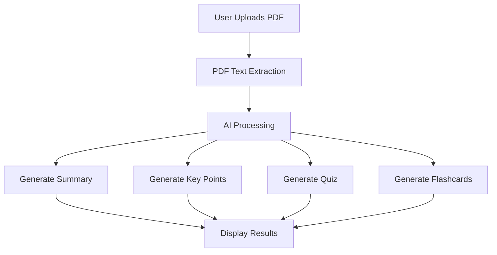

# AI Study Notes Generator

  

---

# 📚 Table of Contents

1. [About the Project](#-about-the-project)
2. [How It Works](#how-it-works)

3. [Flowchart](#-flowchart)
4. [Results and Analysis](#-results-and-analysis)
5. [Technologies Used](#-technologies-used)
6. [Features](#-features)
7. [Future Improvements](#-future-improvements)
8. [Conclusion](#-conclusion)

---

# 📖 About the Project

AI Study Notes Generator is an AI-powered learning application designed to help students study smarter and faster.

Users can upload PDF notes, textbooks, lecture slides, or study materials, and the application automatically converts them into:

✅ AI-generated summaries  
✅ Important key points  
✅ Interactive quizzes  
✅ Smart flashcards  

The application saves time, improves revision efficiency, and makes learning more interactive using advanced AI technologies.

---

# ⚙️ How It Works 

1. User uploads a PDF file.
2. The application extracts text from the PDF.
3. AI models process and analyze the content.
4. The system generates:
   - Summary
   - Key Points
   - Quiz Questions
   - Flashcards
5. Results are displayed instantly to the user.

---

# 🔄 Flowchart

---

# 📊 Results and Analysis

## 🏠 Home Page

---

## 📝 AI Generated Summary 

---

## 📂 Bulletin Points

---

## ❓ Quiz 

---

## 🃏Flashcards

---

## 📈 Analysis

- Reduces manual note-making effort.
- Helps students revise faster.
- Improves memory retention through quizzes and flashcards.
- Converts lengthy study material into concise learning content.
- Provides a user-friendly and efficient study experience.

---

# 🛠 Technologies Used

| Technology | Purpose |
|------------|----------|
| Python | Backend Development |
| Streamlit | Frontend UI |
| Gemma | AI Text Processing |
| Gemini | Content Understanding |
| Claude | Summarization |
| Grok | AI Reasoning |
| PyPDF2 | PDF Text Extraction |
| HTML/CSS | Styling and UI |

---

# ✨ Features

- 📄 Upload PDF Notes
- 🤖 AI-Powered Summaries
- 📌 Key Point Extraction
- 🧠 Quiz Generation
- 🃏 Flashcard Creation
- ⚡ Fast Processing
- 🎨 Simple User Interface

---

# 🚀 Future Improvements

- Multi-language support
- Voice-based study assistant
- AI-powered personalized learning
- Cloud storage integration
- Advanced quiz difficulty levels
- Mobile app version

---

# 🎯 Conclusion

AI Study Notes Generator helps students learn more effectively by transforming lengthy PDF notes into smart study material using advanced AI technologies. The application makes studying easier, faster, and more interactive through summaries, quizzes, and flashcards.

---

# 👨‍💻 Developed By

Daksh Mistry
